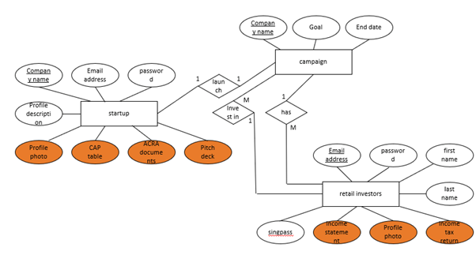
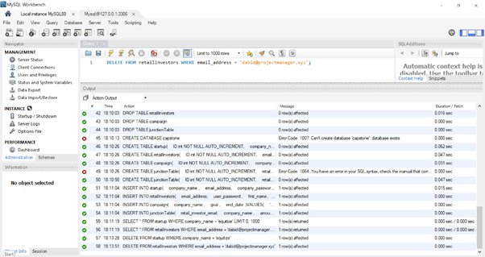
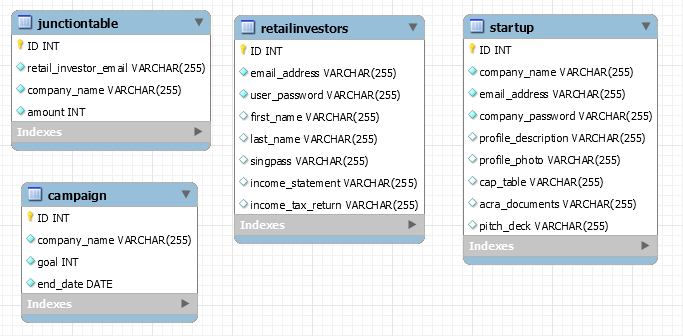

We will be using google cloud sql as of discussion on 19/5.

| Progress                                 | Complete? |
| ---------------------------------------- | --------- |
| ER diagram to create schema for database | done      |
| CRUD operations for database             | done      |
| Integration with javascript              |           |
| CloudSQL integration                     |           |

**ER diagram**

Legend: 
- Underline is UNIQUE.
- Orange highlight means blob data. In SQL, we will store link to cloud storage.

Total tables:
- startup(as shown in ER diagram)
- retail investors(as shown in ER diagram)
- campaign(as shown in ER diagram)
- junction table for campaign to retail investor

Some concerns:
- Search by campaign to get the investors in order to get the total sum invested. In order to view campaign by investor, will need secondary key. I can solve this by adding to both campaign tables and retail investors table in the request to invest and lower the time for search at the cost of increased storage. A better solution would be to use junction table to solve this. => M-to-M relationship
https://stackoverflow.com/questions/7296846/how-to-implement-one-to-one-one-to-many-and-many-to-many-relationships-while-de

**Testing done on local mySQL workbench**
- Go to database> connect to database
- Write sql query, then execute using the lightning symbol

visualisation of schema via SQL

**Setting up CloudSQL**
https://cloud.google.com/sql/docs/mysql/quickstart

**Helpful Links**

http://jcsites.juniata.edu/faculty/rhodes/dbms/ermodel.htm

https://stackoverflow.com/questions/5618357/sql-server-null-vs-empty-string

https://superuser.com/questions/360838/mysql-workbench-visualization-for-schema

