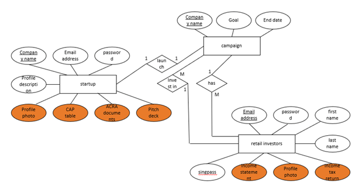
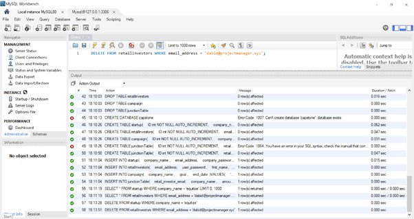
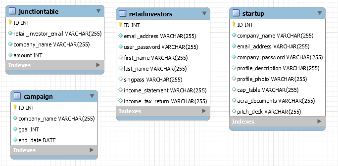
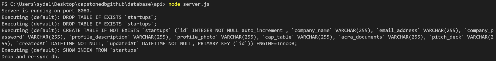
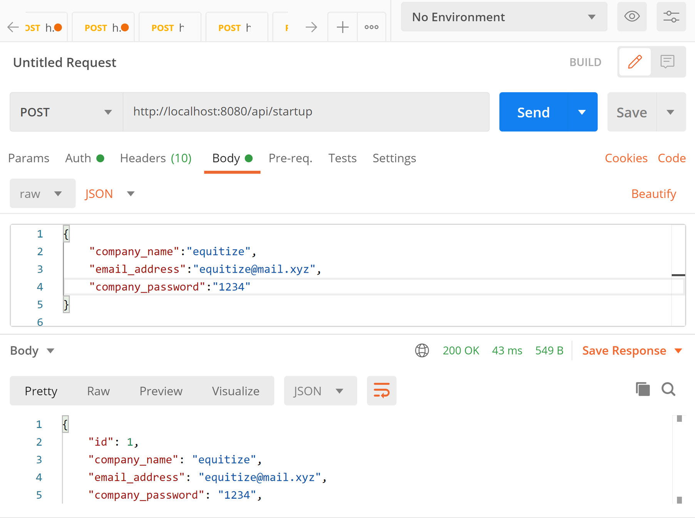

We will be using google cloud sql as of discussion on 19/5.

| Progress                                             | Complete? |
| ---------------------------------------------------- | --------- |
| ER diagram to create schema for database             | done      |
| CRUD operations for database                         | done      |
| Integration of mysql with nodejs, express, sequelize |           |
| CloudSQL integration                                 |           |
| proper config with prod/ dev + .gitignore            |           |


**ER diagram**



Legend: 
- Underline is UNIQUE.
- Orange highlight means blob data. In SQL, we will store link to cloud storage.


Total tables:
- startup(as shown in ER diagram)
- retail investors(as shown in ER diagram)
- campaign(as shown in ER diagram)
- junction table for campaign to retail investor

Some concerns:
- Search by campaign to get the investors in order to get the total sum invested. In order to view campaign by investor, will need secondary key. I can solve this by adding to both campaign tables and retail investors table in the request to invest and lower the time for search at the cost of increased storage. A better solution would be to use junction table to solve this. => M-to-M relationship
https://stackoverflow.com/questions/7296846/how-to-implement-one-to-one-one-to-many-and-many-to-many-relationships-while-de

**Testing done on local mySQL workbench**
- Go to database> connect to database
- Write sql query, then execute using the lightning symbol



visualisation of schema via SQL



**API - nodejs express with mysql**

https://bezkoder.com/node-js-express-sequelize-mysql/

To start the backend server, ```cd api``` + ```node server.js```.

in order for it to work with local db, please take note of user, password, db (must be created beforehand) in ```config>db.config.js```

Setup success command line


Test with Postman


Instead of implementing the sum of total amount crowdfunded for campaign in sql, I think it should be done on front end instead because of latency to access sql.

Test Api Routes

| Api Routes               | Startup | Retail Investors | Campaign | Junction Table |
| ------------------------ | ------- | ---------------- | -------- | -------------- |
| Insert                   | done    | done             | done     | done           |
| Get all                  | done    | done             | done     | done           |
| Get by id                | done    | done             | done     | done           |
| Update by id             | done    | done             | done     | done           |
| Delete by id             | done    | done             | done     | done           |
| Delete all               | done    | done             | done     | done           |
| Retrieve by company name | done    | NA               | done     | done           |
| Retrieve by email        | done    | done             | NA       | done           | 

Things to check for:
- table schema (done)
- check if all required sql functions for front end are implemented (done)
- constraints for SQL (done)
- naming conventions for router (done)

routing naming convention used : 

```http://localhost:8080:/api/{table_name}/{query_key}/{query_value}```

i.e. In order to retrieve entries with company_name == bloo in campaign table, in Postman you can ```GET http://localhost:8080/api/campaign/company_name/bloo```


https://expressjs.com/en/guide/routing.html


constraints for sql in sequelize 

https://sequelize.org/master/manual/validations-and-constraints.html

**Setting up CloudSQL**

https://cloud.google.com/sql/docs/mysql/quickstart


**Helpful Links**

http://jcsites.juniata.edu/faculty/rhodes/dbms/ermodel.htm

https://stackoverflow.com/questions/5618357/sql-server-null-vs-empty-string

https://superuser.com/questions/360838/mysql-workbench-visualization-for-schema

https://www.guru99.com/mvc-tutorial.html

https://stackoverflow.com/questions/27178077/how-to-change-user-in-mysql-workbench/49203236

https://blog.logrocket.com/node-js-express-js-mysql-rest-api-example/

https://bezkoder.com/node-js-rest-api-express-mysql/

https://stackoverflow.com/questions/22348705/best-way-to-store-db-config-in-node-js-express-app

should have used swagger at the start of the project for creating api 

https://medium.com/swlh/the-easiest-way-to-start-using-swagger-in-node-js-54326864e74f

